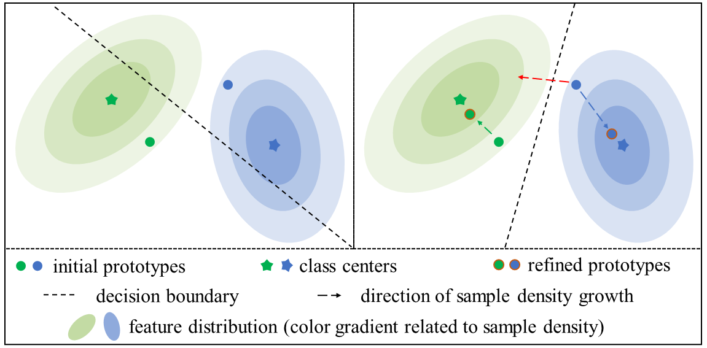

# DIPO

This page is for our paper "A Density-driven Iterative Prototype Optimization for Transductive Few-shot Learning" [IJCAI 2024]




## Feature extractors

We use the same backbone network and training strategies as 'S2M2_R'. Please refer to the [link](https://github.com/nupurkmr9/S2M2_fewshot) for the backbone training.  


Or you can download features/pretrained models from [here](https://drive.google.com/drive/folders/1IjqOYLRH0OwkMZo8Tp4EG02ltDppi61n) and unzip it. After downloading the extracted features, please adjust your file path according to the code.


## Evaluate

To evaluate the proposed method, run:

```
python evaluate_DIPO.py
```


## References 

This code is based on the implementations：

[Charting the Right Manifold: Manifold Mixup for Few-shot Learning](https://github.com/nupurkmr9/S2M2_fewshot)

[FREE LUNCH FOR FEW-SHOT LEARNING: DISTRIBUTION CALIBRATION](https://github.com/ShuoYang-1998/Few_Shot_Distribution_Calibration?tab=readme-ov-file)


